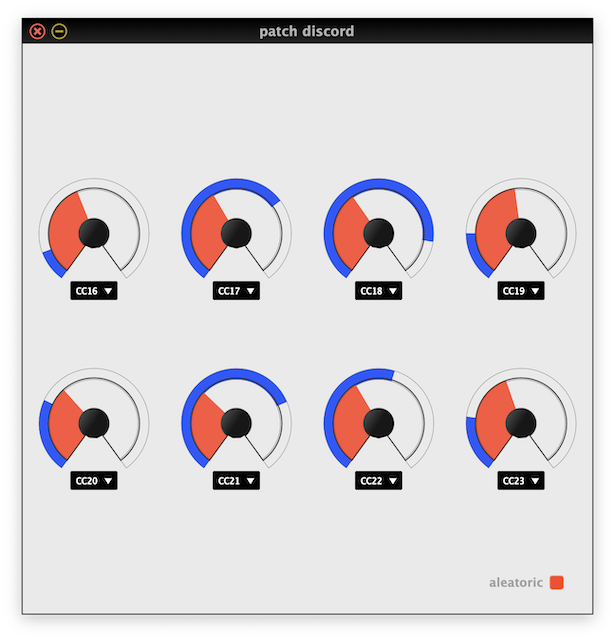

# Patch Discord

## The aleatoric MIDI router

The aletoric MIDI router is a device that serves the purpose of erasing the
labels from the control knobs of a synthesizer.

The VST plugin binary can be downloaded from the
[releases](https://github.com/maxklint/patch-discord/releases).

The `doc/` folder contains the user manual for the plugin, as well as the
detailed description of the concept of the aleatoric router.

There is a short video demo on youtube:
[https://youtu.be/jr8MLbZk7VY](https://youtu.be/jr8MLbZk7VY).

## Installation

The plugin is built with [Cabbage](http://cabbageaudio.com). In order to run
it, [CSound](https://csound.com/download.html) has to be installed.

The binary is supposed to be portable, but so far it has only been tested on
a Mac using Ableton Live. There is a 'debug' release which adds the csound
console to the GUI. It can be used for troubleshooting.

## Support

Please, create an issue on github if you notice that the plugin is
malfunctioning or if you wish for certain features to be added.