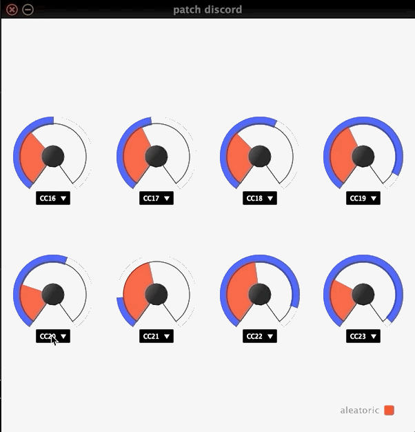

# User Manual

## Patch Discord - VST Plugin Prototype

The prototype of the Patch Discord combines the controller with the router.
The router has 8 inputs and 8 outputs. Values of the controller knobs are fed
to the router. The red indicator on the knob represents the current position
of the knob head, i.e. the input of the router. The blue indicator represents
the output of the router. The operation of the router can be observed when
one of the knobs is rotated: all outputs are to some extent affected by the
input change.

Combo-boxes below the knobs allow selection of the output midi CC. MIDI
output is sent to MIDI channel 1.

In the bottom right corner is the mode switch. When the 'aleatoric' mode is
ON (indicator is red), the router performs the permutation on its inputs.
When the indicator is grey, the router is OFF: output simply mirrors the
input. This mode can be useful in conjunction with the MIDI learn mode on a
controller synthesizer.
